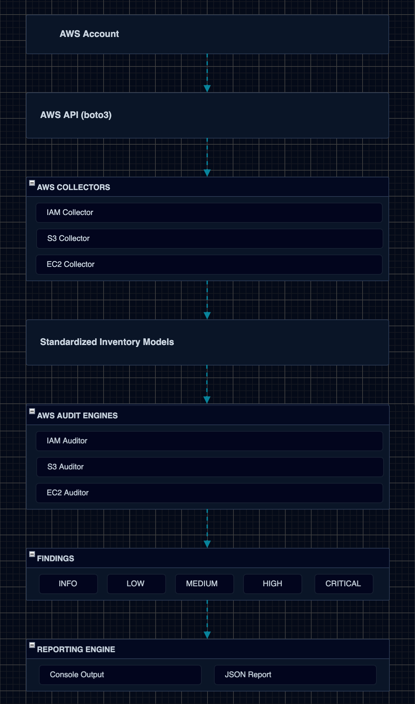
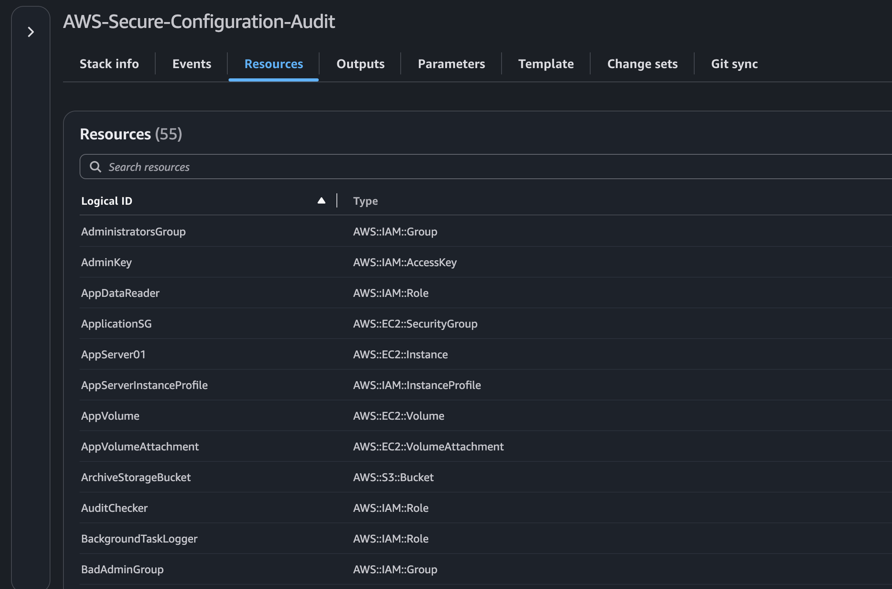
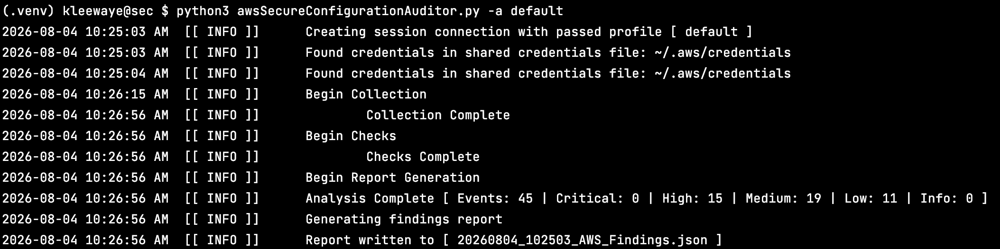
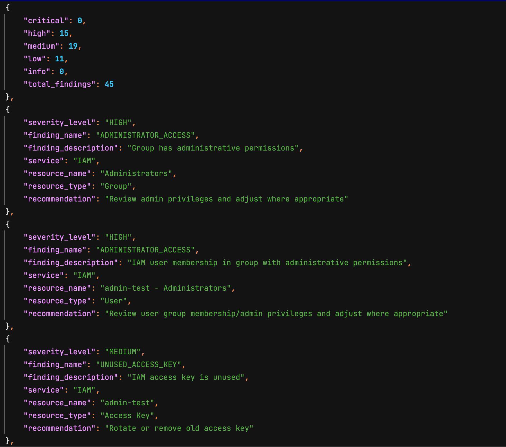

# AWS Secure Configuration Auditor

A Python-based security auditing tool for assessing AWS environments against common cloud security best practices.

The goal of this project is to provide a lightweight, modular framework for identifying AWS security misconfigurations and producing structured security findings through both console and JSON reporting.

---
## Features

- Inventory AWS IAM, Amazon S3, and Amazon EC2 resources
- Perform automated security configuration checks
- Produce standardized findings with severity ratings
- Generate JSON reports for further analysis
- Modular collector and audit engine architecture
- Designed for easy expansion to additional AWS services

---

# Architecture
The AWS Secure Configuration Auditor follows a modular, pipeline-based architecture that separates AWS resource collection from security analysis. Each stage has a single responsibility, making the application easier to extend, test, and maintain.

## Architecture Overview



## Architecture Workflow

The auditor follows a staged pipeline separating resource collection from security analysis.

1. Collect AWS resource inventory.
2. Normalize collected data.
3. Execute service-specific audit checks.
4. Aggregate findings.
5. Generate console and JSON reports.

---

## Component Overview
### AWS Audit Session

The audit session establishes authenticated AWS clients using the AWS SDK for Python (boto3). These clients are shared across the application to retrieve AWS resource information.

---

### AWS Collectors

Collectors are responsible solely for gathering an inventory for AWS resources.

Current collectors:

- IAM Collector
- Amazon S3 Collector
- Amazon EC2 Collector

The sole purpose of the Collectors is restricted to gathering the multiple instances of configuration data and storing that data in the standardized inventory models defined for the project.
Collectors do not perform any security analysis. 

---

### Standardized Inventory Models

Each collector returns a strongly structured inventory object representing the current configuration of an AWS service.

Examples include:

- IAMInventory
- S3Inventory
- EC2Inventory

These inventory models decouple AWS API interactions from the security checking logic.

---

### AWS Audit Engine

The AWS Audit Engine coordinates service-specific audit engines.

Current audit engines include:

- IAM Audit
- Amazon S3 Audit
- Amazon EC2 Audit

Each audit engine executes a series of security checks against its corresponding inventory object.

Examples include:

- MFA Enabled Check
- Public Bucket Check
- SSH Public Exposure Check
- EBS Encryption Check

Each check produces zero or more standardized findings.

---
### Reporting Engine

The reporting engine aggregates findings generated by every audit engine and produces:

- Console output
- JSON findings report

Because every finding shares a common data model, reporting remains independent of the AWS service being audited.

---

## Design Principles

The project is built around several core design principles:

- Separation of collection and security analysis
- Service-specific audit engines
- Standardized inventory models
- Consistent finding structure
- Modular and extensible architecture

This design allows additional AWS services (such as VPC, CloudTrail, GuardDuty, AWS Config, and KMS) to be introduced with minimal changes to the overall application workflow.

---

# Detection Matrix

The AWS Secure Configuration Auditor evaluates AWS resources against a collection of security best practices. Each security check produces standardized findings that include a severity rating, affected resource, description of the issue, and a recommended remediation.

---

## Identity and Access Management (IAM)

| Check | Severity | Detected Finding | Resource Type | Example Resource | Description | Recommendation |
| :--- | :---: | :--- | :--- | :--- | :--- | :--- |
| AdministratorAccessCheck | HIGH | `ADMINISTRATOR_ACCESS` | IAM User / Group | `admin-test` | User or group has full administrative permissions. | Review permissions and implement the principle of least privilege. |
| MFAEnabledCheck | HIGH | `MFA_DISABLED` | IAM User | `bob` | Interactive IAM user does not have multi-factor authentication enabled. | Enable MFA for all interactive users. |
| OldAccessKeyCheck | MEDIUM | `OLD_ACCESS_KEY` | IAM Access Key | `charlie` | Active access key exceeds the recommended rotation period. | Rotate or replace the access key. |
| InactiveAccessKeyCheck | LOW | `UNUSED_ACCESS_KEY` | IAM Access Key | `unused-user` | Active access key has not been used recently. | Disable or remove unused access keys. |
| WildcardPolicyCheck | HIGH | `WILDCARD_POLICY` | IAM Policy | `WildcardPolicy` | IAM policy grants wildcard (`*`) permissions. | Replace wildcard permissions with least-privilege permissions. |
| RootAccessKeyCheck | CRITICAL | `ROOT_ACCESS_KEY` | Root Account | `Root Account` | AWS root account has active access keys. | Remove root access keys immediately. |
| ConsoleAccessCheck | LOW | `CONSOLE_ACCESS_ENABLED` | IAM User | `contractor` | Console access is enabled for the IAM user. | Remove console access if interactive login is unnecessary. |
| UnusedUserCheck | LOW | `UNUSED_USER` | IAM User | `unused-user` | IAM user appears to be inactive. | Review and remove the account if no longer required. |

**Total IAM Checks:** **8**

---

## Amazon S3

| Check | Severity | Detected Finding | Resource Type | Example Resource | Description | Recommendation |
| :--- | :---: | :--- | :--- | :--- | :--- | :--- |
| PublicBucketCheck | HIGH | `PUBLIC_BUCKET` | S3 Bucket | `marketing-assets` | Bucket permits public access. | Disable public access or verify that public access is intentional. |
| BucketACLCheck | HIGH | `PUBLIC_BUCKET_ACL` | S3 Bucket | `sandbox-data` | Bucket ACL grants public permissions. | Remove public ACLs and rely on IAM policies where possible. |
| BucketEncryptionCheck | HIGH | `ENCRYPTION_DISABLED` | S3 Bucket | `archive-storage` | Server-side encryption is disabled. | Enable server-side encryption. |
| BucketVersioningCheck | MEDIUM | `VERSIONING_DISABLED` | S3 Bucket | `finance-documents` | Bucket versioning is disabled. | Enable bucket versioning. |
| BucketLoggingCheck | MEDIUM | `LOGGING_DISABLED` | S3 Bucket | `engineering-artifacts` | Server access logging is disabled. | Enable server access logging. |
| PublicAccessBlockCheck | HIGH | `PUBLIC_ACCESS_BLOCK_DISABLED` | S3 Bucket | `sandbox-data` | Public Access Block is disabled. | Enable all Public Access Block settings. |
| BucketOwnershipCheck | LOW | `OWNERSHIP_CONTROLS_MISSING` | S3 Bucket | `sandbox-data` | Bucket Owner Enforced ownership controls are not configured. | Enable Bucket Owner Enforced ownership controls. |

**Total Amazon S3 Checks:** **7**

---

## Amazon EC2

| Check | Severity | Detected Finding | Resource Type | Example Resource | Description | Recommendation |
| :--- | :---: | :--- | :--- | :--- | :--- | :--- |
| OpenSSHCheck | HIGH | `SSH_PUBLICLY_ACCESSIBLE` | Security Group | `LegacySG` | Security group allows inbound SSH access from the Internet. | Restrict SSH access to trusted IP addresses. |
| OpenRDPCheck | HIGH | `RDP_PUBLICLY_ACCESSIBLE` | Security Group | `LegacySG` | Security group allows inbound RDP access from the Internet. | Restrict RDP access to trusted IP addresses. |
| OpenDatabasePortCheck | HIGH | `DATABASE_PUBLICLY_ACCESSIBLE` | Security Group | `DatabaseSG` | Database service is accessible from the Internet. | Restrict database access to application hosts only. |
| IMDSv2Check | MEDIUM | `IMDSV2_DISABLED` | EC2 Instance | `legacy-server-01` | Instance Metadata Service Version 2 is not required. | Configure the instance to require IMDSv2. |
| EBSEncryptionCheck | HIGH | `UNENCRYPTED_EBS_VOLUME` | EBS Volume | `DatabaseVolume` | Attached EBS volume is not encrypted. | Enable EBS encryption. |
| InternetExposureCheck | HIGH | `PUBLIC_MANAGEMENT_INTERFACE` | EC2 Instance | `legacy-server-01` | Publicly accessible management interface detected. | Restrict administrative services or remove the public IP. |
| MissingIAMRoleCheck | LOW | `MISSING_IAM_ROLE` | EC2 Instance | `legacy-server-01` | EC2 instance does not have an IAM role attached. | Attach a least-privilege IAM role if AWS API access is required. |

**Total Amazon EC2 Checks:** **7**

---

## Summary

| AWS Service | Security Checks |
| :--- | ---: |
| Identity and Access Management (IAM) | 8 |
| Amazon S3 | 7 |
| Amazon EC2 | 7 |
| **Total Checks** | **22** |

---

## Severity Definitions

| Severity | Description |
| :--- | :--- |
| **CRITICAL** | Immediate security risk requiring urgent remediation. |
| **HIGH** | Significant security weakness that could lead to compromise. |
| **MEDIUM** | Security best practice not implemented or partially configured. |
| **LOW** | Minor security improvement or configuration recommendation. |
| **INFO** | Informational observation with no immediate security impact. |

---

# Example Findings

---

# Project Structure

```text
AWS-secure-configuration-auditor/
│
├── src/
│   ├── awsSecureConfigurationAuditor.py      # Application entry point
│   ├── awsAuditSession.py                    # Creates authenticated AWS service clients
│   ├── awsCollector.py                       # Coordinates AWS resource collection
│   ├── awsAuditEngine.py                     # Coordinates service-specific audit engines
│   ├── AWSStandardizedDataStructures.py      # Inventory and finding data models
│   │
│   ├── aws_audit_collectors/
│   │   ├── baseCollector.py
│   │   ├── iam_audit_collector.py
│   │   ├── s3_audit_collector.py
│   │   └── ec2_audit_collector.py
│   │
│   ├── aws_audit_checkers/
│   │   ├── baseChecker.py
│   │   ├── iam_audit_checker.py
│   │   ├── s3_audit_checker.py
│   │   └── ec2_audit_checker.py
│   │
│   └── aws_audit_reporter/
│       ├── baseReporter.py
│       └── awsReportGenerator.py
│
├── docs/
│   └── AWS-Audit-Configuration.yaml
│
├── examples/
│   └── Example_AWS_Findings.json
│
├── screenshots/
│   ├── AWS-CLI-Auditing.png
│   ├── AWS-CloudFormation-Resources.png
│   ├── AWS-SCA-Architecture.png
│   └── AWS-SCA-JSON-Results.png
│
├── README.md
├── requirements.txt
└── LICENSE
```

---

# AWS Test Environment

To validate each implemented security check, a dedicated AWS test environment was developed using an AWS CloudFormation template.

The template provisions a representative AWS environment containing both secure and intentionally insecure configurations across Identity and Access Management (IAM), Amazon S3, and Amazon EC2. This approach provides a repeatable testing environment, allowing the auditor to be validated against known configurations while eliminating the need for manual resource creation.

Because the environment is deployed using Infrastructure as Code (IaC), it can be recreated at any time, ensuring consistent testing throughout future development and when additional AWS services are introduced.

---

# Deploying the Test Environment

The AWS test environment can be deployed using the AWS CLI.

```bash
aws cloudformation create-stack \
  --stack-name security-audit-lab-environment \
  --template-body file://AWS-Audit-Configuration.yaml \
  --capabilities CAPABILITY_NAMED_IAM
```

Once deployment has completed successfully, the AWS Secure Configuration Auditor can be executed against the newly provisioned environment.

---

# Test Environment Overview

The CloudFormation template provisions approximately **55 AWS resources** across the supported AWS services.

| AWS Service | Provisioned Resources |
| :--- | :--- |
| **Identity and Access Management (IAM)** | Users, Groups, Roles, Policies, Access Keys, Login Profiles, MFA Devices |
| **Amazon S3** | Buckets configured with varying public access, encryption, logging, versioning, and ownership settings |
| **Amazon EC2** | EC2 Instances, Security Groups, IAM Instance Profiles, and EBS Volumes configured with secure and intentionally insecure settings |

The environment contains both compliant and non-compliant configurations in order to validate each implemented audit check.

Examples include:

- IAM users with and without multi-factor authentication
- IAM policies containing wildcard permissions
- Active and inactive IAM access keys
- Public and private Amazon S3 buckets
- Encrypted and unencrypted S3 buckets
- Versioned and non-versioned buckets
- EC2 instances with and without IAM roles
- Security groups exposing administrative services
- Encrypted and unencrypted EBS volumes
- EC2 instances configured with and without IMDSv2

---

# CloudFormation Deployment

The screenshot below illustrates the deployed CloudFormation stack and the AWS resources provisioned for the testing environment.



The CloudFormation stack provides a repeatable deployment that serves as the baseline environment used throughout the development and validation of the AWS Secure Configuration Auditor.

Any future security checks or supported AWS services can be validated by extending the CloudFormation template and redeploying the environment, ensuring that testing remains consistent and reproducible.

---

# Installation


## Prerequisites

Before running the AWS Secure Configuration Auditor, ensure the following requirements are met:

- Python 3.10 or later
- An AWS account
- AWS CLI configured with valid credentials
- Appropriate IAM permissions to enumerate AWS resources

---

## Clone the Repository

```bash
git clone https://github.com/leewaye-sec/AWS-secure-configuration-auditor.git

cd AWS-secure-configuration-auditor
```

---

## Create a Virtual Environment

### Linux / macOS

```bash
python3 -m venv venv

source venv/bin/activate
```

### Windows

```powershell
python -m venv venv

venv\Scripts\activate
```
---

## Install Dependencies

```bash
pip install -r requirements.txt
```

---

## Configure an AWS CLI Profile

The auditor authenticates using an AWS CLI profile specified at runtime.

Create a profile using:

```bash
aws configure --profile audit-profile
```

The profile will be referenced using the required `-a` command-line argument.

---

# Usage

## Basic Execution

Execute the auditor by specifying the AWS CLI profile to use.

```bash
python src/awsSecureConfigurationAuditor.py -a audit-profile
```

---

## Specify an Output Report

Generate a custom JSON report.

```bash
python src/awsSecureConfigurationAuditor.py -a audit-profile --output findings.json
```

---

## Enable Verbose Logging

Display inventory collection and security findings while the audit executes.

```bash
python src/awsSecureConfigurationAuditor.py -a audit-profile -v
```

---

## Display Help

View all available command-line options.

```bash
python src/awsSecureConfigurationAuditor.py --help
```

---

# Example Output

The following examples demonstrate the output generated by the AWS Secure Configuration Auditor after analyzing the AWS test environment.

---

## Console Output

During execution, the auditor reports inventory normalization, security findings, and overall audit statistics.



---

## JSON Findings Report

After analysis completes, all findings are written to a structured JSON report suitable for further processing or integration with other tools.



Each finding contains:

- Severity
- AWS Service
- Resource Type
- Resource Name
- Finding Identifier
- Description
- Recommendation

Example:

```json
{
  "severity_level": "HIGH",
  "finding_name": "ADMINISTRATOR_ACCESS",
  "finding_description": "Group has administrative permissions",
  "service": "IAM",
  "resource_name": "Administrators",
  "resource_type": "Group",
  "recommendation": "Review admin privileges and adjust where appropriate"
}
```

---
# Future Enhancements
The modular design of the AWS Secure Configuration Auditor allows additional AWS services to be integrated with minimal changes to the existing architecture.

Planned additions include:

- **Amazon VPC** – Network security auditing
- **CloudTrail** – Logging and audit trail validation
- **AWS Config** – Configuration compliance auditing
- **Amazon GuardDuty** – Threat detection configuration validation
- **AWS KMS** – Encryption and key management auditing
- **Amazon CloudWatch** – Monitoring and logging configuration analysis

As new AWS services are added, they will follow the same architectural pattern of resource collection, standardized inventory modeling, service-specific audit engines, and standardized findings.

---

# License
MIT License